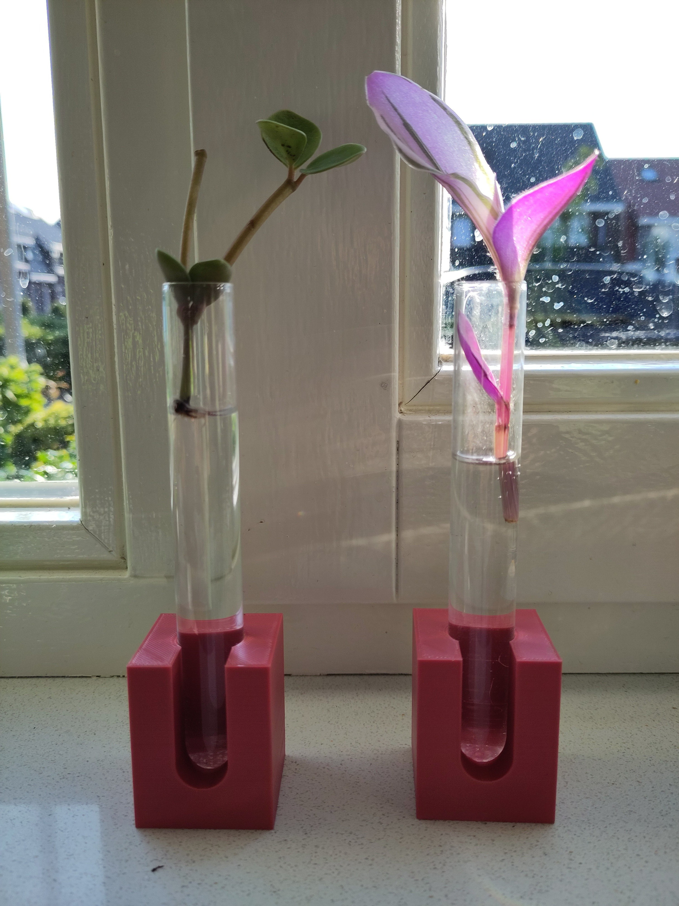
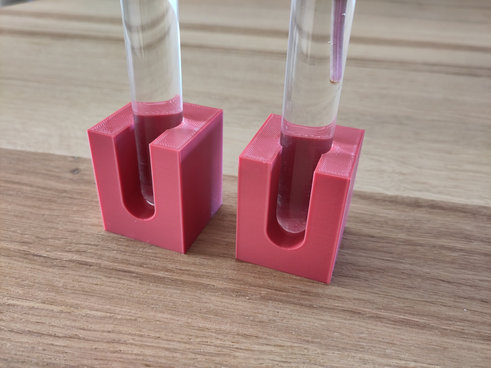

<!-- SPDX-License-Identifier: CC-BY-NC-SA-4.0 -->
<!-- Copyright 2018 Ivo Meier <https://www.thingiverse.com/ivorness> -->
<!-- Copyright 2022 Casper Meijn <casper@meijn.net> -->
<!-- To view a copy of this license, visit http://creativecommons.org/licenses/by-nc-sa/4.0/ -->

# Test-tube holder v2

Design for a test-tube holder. Our test tubes were the packaging of some herbs. Now they are in a holder with plant cuttings inside.

Based on the work of Ivo Meier: https://www.thingiverse.com/thing:2773490
I fixed the front cut when diameter of glas is < 25 mm.

Open is customizer to adjust it to your needs - have fun!

